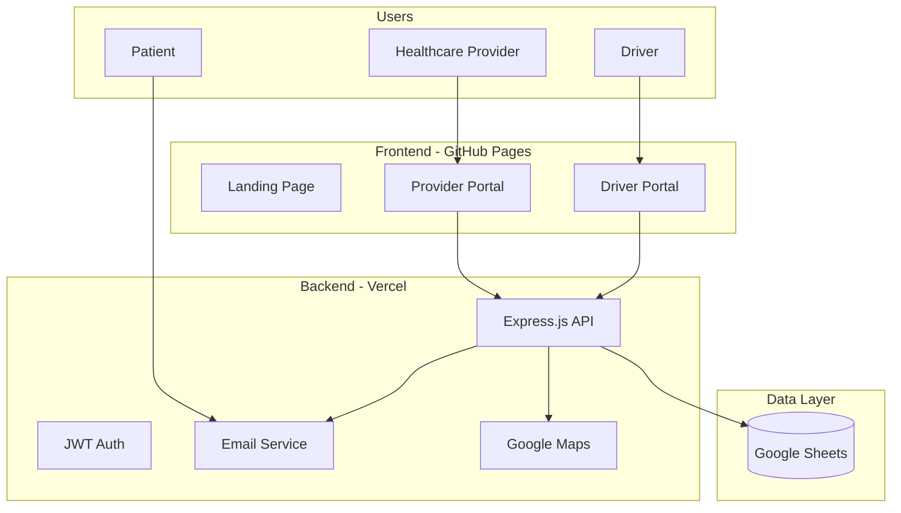
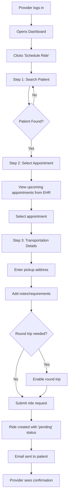
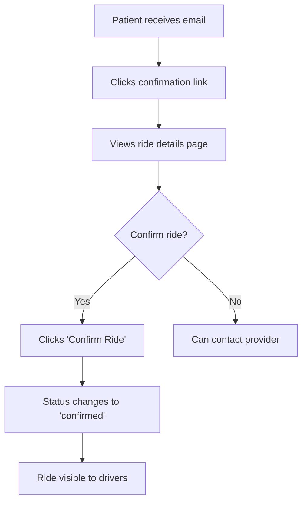
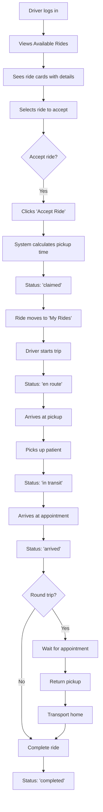
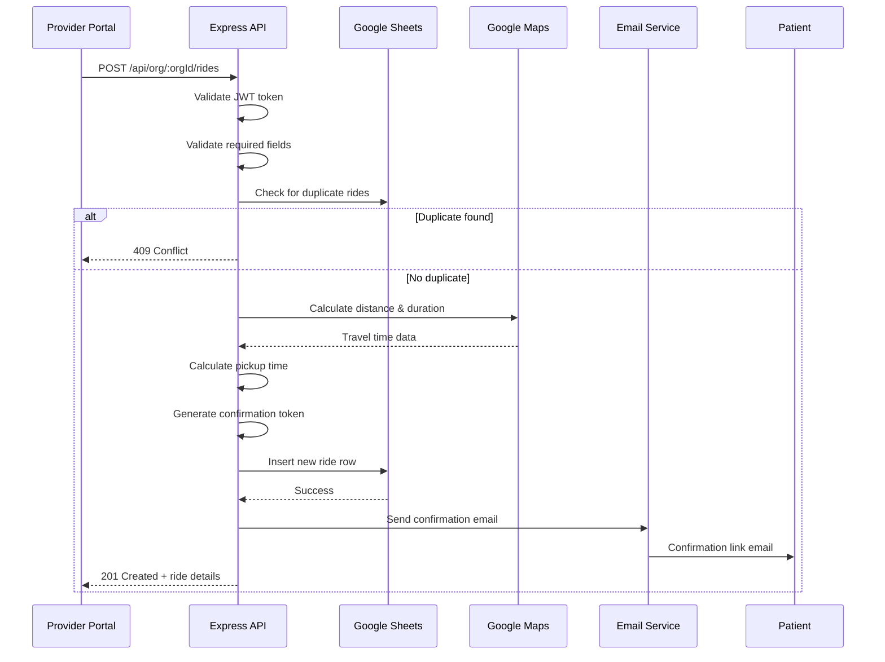
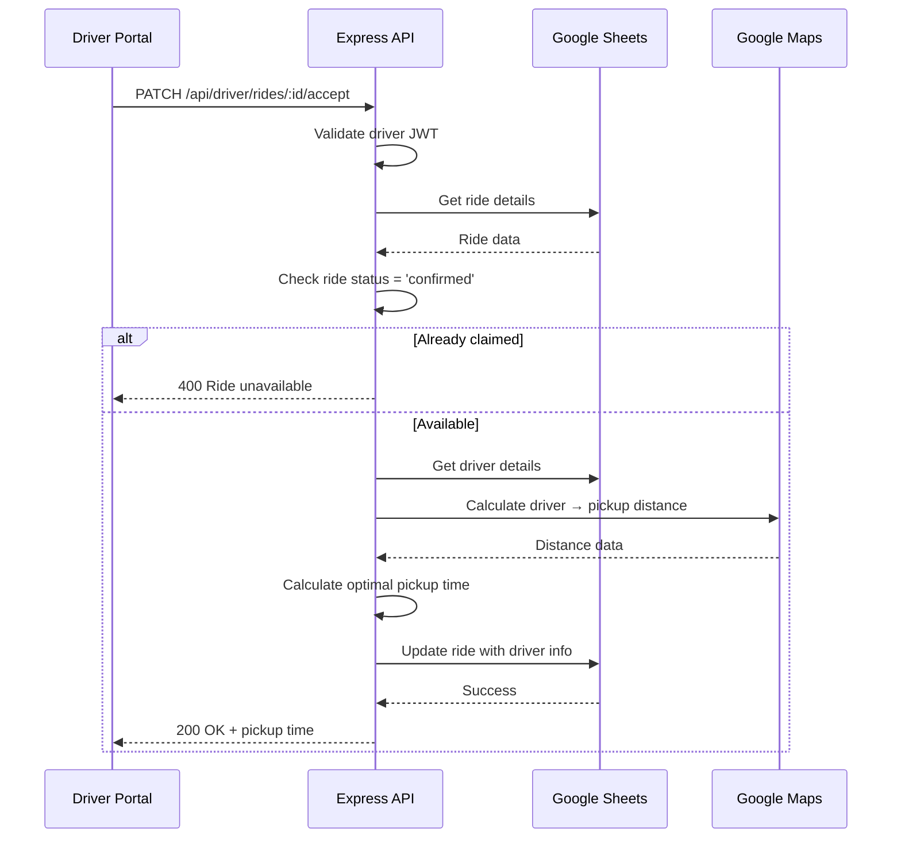
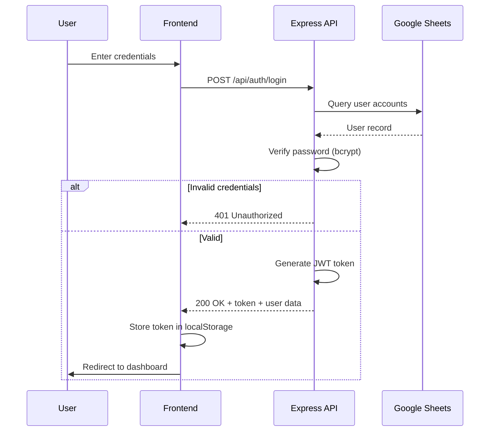
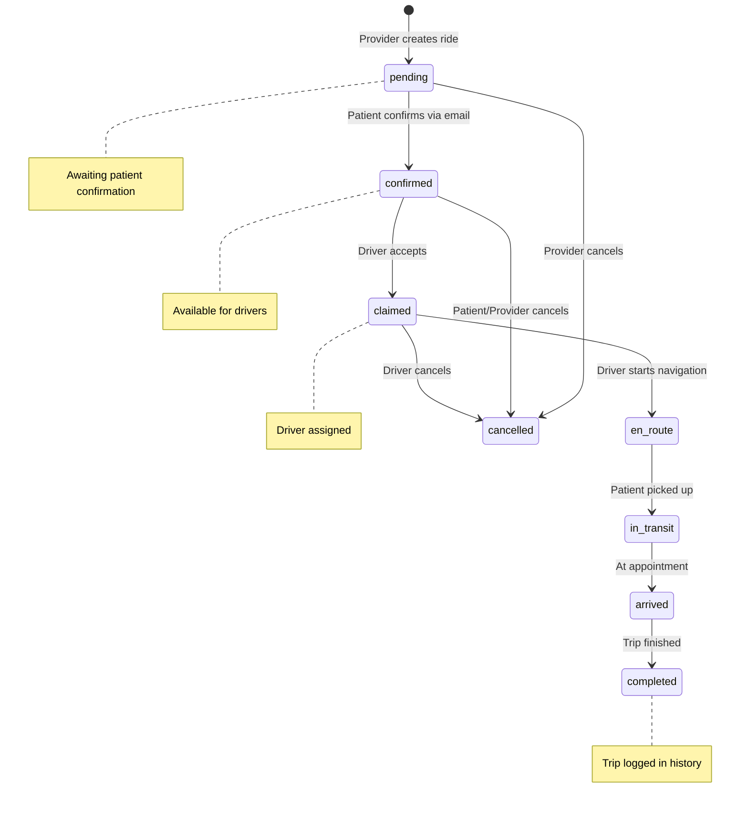
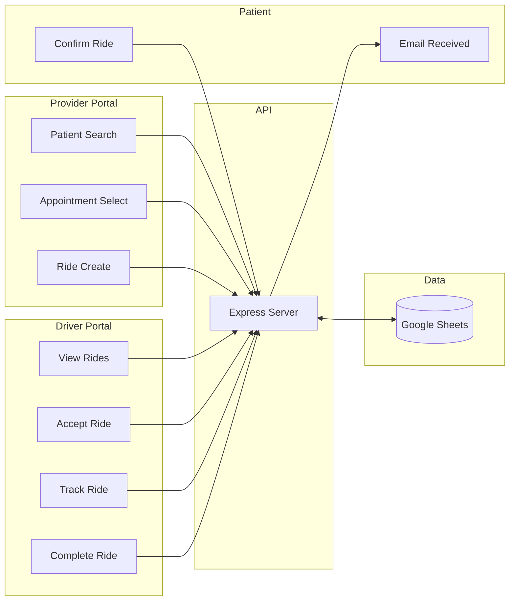
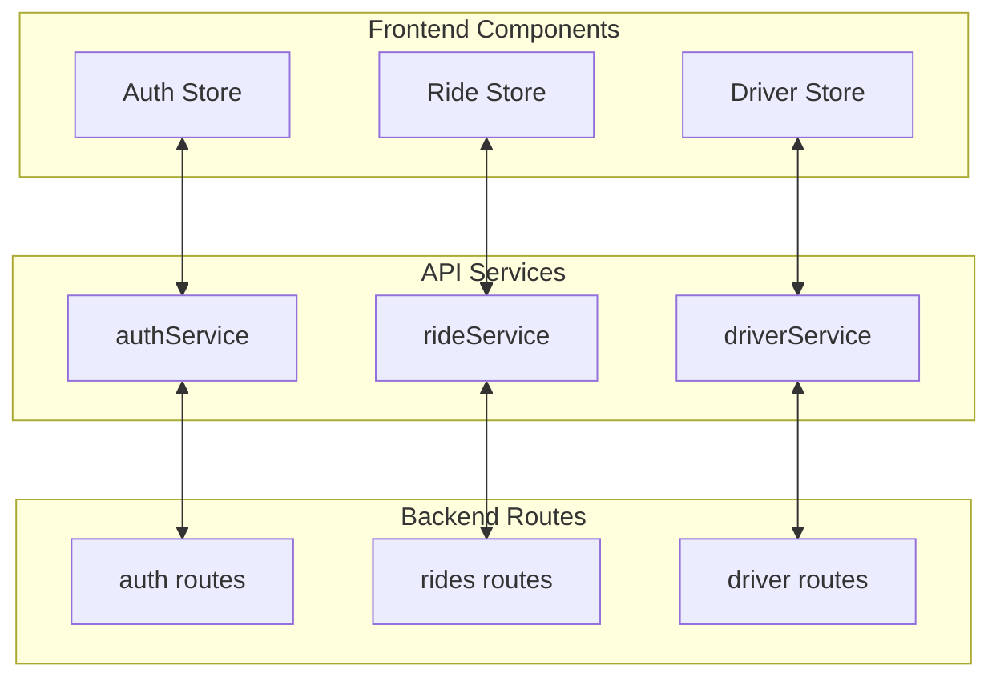

# MedRoute Suite - Flow Diagrams

Detailed user and technical flow diagrams for the MedRoute Suite healthcare transportation platform.

---

## Our System Design Process

As part of ECEG 301, we followed a structured systems engineering approach to design and build MedRoute Suite. This document captures how we worked through each phase of the design process, using diagrams to communicate our thinking and validate our architecture decisions.

### 1. Problem Identification

Through our research aligned with UN SDG 3 (Good Health and Wellbeing), we identified **transportation as a key challenge in rural areas**. Many patients miss critical medical appointments simply because they lack reliable transportation options. This problem disproportionately affects elderly patients, those with disabilities, and low-income communities where public transit is limited or nonexistent.

### 2. Stakeholder Identification

We began by identifying the key users who would interact with our system. Through interviews and research, we identified three primary stakeholders:

- **Healthcare Providers** - Staff at medical facilities who need to arrange transportation for patients
- **Patients** - Individuals who need rides to medical appointments but may lack reliable transportation
- **Drivers** - Volunteer or employed drivers who provide the transportation service

This stakeholder analysis directly informed our system architecture, ensuring each user type has a dedicated interface tailored to their needs.

### 2. High-Level Architecture Design

With our stakeholders defined, we designed the system architecture to show how each component connects. We chose a decoupled architecture with:

- **Separate frontend portals** for providers and drivers (different use cases, different interfaces)
- **Centralized backend API** handling all business logic
- **Google Sheets as our database** (rapid prototyping, easy data inspection during development)
- **Third-party services** for email notifications and distance calculations

---

## System Architecture

### Why This Architecture?

We chose this architecture based on several key decisions:

1. **Static frontend hosting (GitHub Pages)** - Free, reliable, and integrates with our version control workflow
2. **Serverless backend (Vercel)** - Scales automatically, no server management, generous free tier
3. **Google Sheets as database** - Allowed non-technical stakeholders to view/edit data during development and testing
4. **Modular services** - Email and Maps are separate concerns, making the system easier to test and maintain

---

## User Flows

### 3. User Journey Mapping

After establishing our architecture, we mapped out the detailed user journeys for each stakeholder. These flowcharts helped us identify all the screens we needed to build and the decision points users would encounter.

### Provider: Scheduling a Ride

### Patient: Confirming a Ride

### Driver: Accepting and Completing a Ride

### What We Learned from User Flow Mapping

Creating these flowcharts helped us:
- **Identify edge cases** - What happens if a patient doesn't confirm? What if a driver cancels mid-trip?
- **Design the status system** - We needed clear states (pending → confirmed → claimed → completed) to track rides
- **Plan the UI/UX** - Each box in the flowchart roughly corresponds to a screen or component we needed to build

---

## Technical Flows

### 4. Sequence Diagram Design

Once we understood the user journeys, we designed the technical implementation using sequence diagrams. These show the exact API calls, database operations, and service integrations that happen behind the scenes.

### Ride Creation - Backend Process

This sequence diagram shows what happens when a provider submits a new ride request. We designed this flow to include:
- **Validation** - Ensuring all required data is present and the appointment isn't in the past
- **Duplicate detection** - Preventing accidental double-bookings
- **Distance calculation** - Using Google Maps to estimate travel time
- **Email notification** - Sending confirmation requests to patients

### Ride Acceptance - Backend Process

When a driver accepts a ride, the system performs several operations to ensure a smooth handoff:

### Authentication Flow

We implemented JWT-based authentication to secure our API. This sequence shows the login process:

### Technical Design Decisions

Through creating these sequence diagrams, we made several key technical decisions:

| Decision | Rationale |
|----------|-----------|
| JWT tokens | Stateless authentication - no session storage needed on serverless backend |
| bcrypt hashing | Industry standard for password security |
| Confirmation tokens | Allows patients to confirm rides without creating accounts |
| Google Maps integration | Accurate travel time estimates for pickup time calculation |

---

## Ride Status Lifecycle

Understanding how a ride transitions through different states was critical for building a reliable system. This state diagram helped us define clear boundaries for what actions are allowed at each stage:

### Status Design Considerations

Creating this state machine helped us answer important questions:

- **Who can cancel when?** Different stakeholders have different cancellation windows based on the ride status
- **What triggers state changes?** Each transition has a specific API endpoint and validation logic
- **How do we prevent race conditions?** A ride must be `confirmed` to be claimed - we check this atomically
- **What happens on errors?** Failed transitions don't corrupt state - rides stay in their current status

---

## Data Flow Overview

---

## Component Interaction

We structured our frontend using a clear separation between UI state management (Zustand stores) and API communication (services). This diagram shows how data flows through our component architecture:

### Why This Architecture

This component structure evolved from our development experience:

1. **Zustand stores** keep global state simple - no prop drilling through deep component trees
2. **Service layer** abstracts API calls - components don't know about HTTP details
3. **Route separation** on the backend mirrors frontend concerns - easier to find code
4. **Bidirectional arrows** represent the request/response cycle each interaction follows
