<p align="center">
  
</p>

<h1 align="center">MedRoute Suite</h1>

<p align="center">
  <strong>Healthcare Transportation Management Platform</strong>
</p>

<p align="center">
  
  
  
  
  
</p>

<p align="center">
  
  
  
</p>

---

## Overview

MedRoute Suite is a comprehensive healthcare transportation management platform designed to streamline patient transportation logistics. It connects healthcare providers with drivers to ensure patients reach their medical appointments safely and on time. This project was created as part of ECEG 301 - Praxis of Engineering Design at Bucknell University in 2025. The goal of the course was to practice systems engineering, planning, and execution while completing research and interviews about topics surrounding United Nations Sustainable Development Goal 3 - Good Health and Wellbeing.

## Architecture


## Project Structure

```mermaid
graph LR
    subgraph Root["📁 ECEG301"]
        B["📁 backend"]
        F["📁 frontend"]
        GH["📁 gh-pages-root"]
        S["📁 scripts"]
    end

    subgraph Backend["backend/"]
        API2["📁 api"]
        ROUTES["📁 routes"]
        SERVICES["📁 services"]
        CONFIG["📁 config"]
    end

    subgraph Frontend2["frontend/"]
        PROV["📁 provider-portal"]
        DRIV["📁 driver-portal"]
    end

    B --> Backend
    F --> Frontend2
```



## Features

| Portal | Features |
|--------|----------|
| **Provider Portal** | Patient search, Appointment management, Ride scheduling, Dashboard analytics |
| **Driver Portal** | Available rides view, Ride acceptance, Real-time status updates, Trip history |

## Ride Workflow


> **See [FLOWS.md](./FLOWS.md) for detailed user and technical flow diagrams.**

## Quick Start

### Prerequisites
- Node.js 20.x
- npm or yarn
- Google Cloud Service Account (for Sheets API)

### Backend Setup
```bash
cd backend
npm install
cp .env.example .env  # Configure environment variables
npm run dev
```

### Frontend Setup
```bash
# Provider Portal
cd frontend/provider-portal
npm install
npm run dev

# Driver Portal
cd frontend/driver-portal
npm install
npm run dev
```

## Live Demo

| Portal | URL |
|--------|-----|
| Landing Page | [acherniske.github.io/ECEG301](https://acherniske.github.io/ECEG301) |
| Provider Portal | [acherniske.github.io/ECEG301/provider](https://acherniske.github.io/ECEG301/provider) |
| Driver Portal | [acherniske.github.io/ECEG301/driver](https://acherniske.github.io/ECEG301/driver) |

## Tech Stack

| Layer | Technology |
|-------|------------|
| **Frontend** | React 19, Vite, TailwindCSS, Zustand, React Router |
| **Backend** | Node.js, Express.js, JWT, bcrypt |
| **Database** | Google Sheets API |
| **Services** | Google Maps API, Nodemailer |
| **Deployment** | Vercel (API), GitHub Pages (Frontend) |

## API Overview

| Endpoint | Description |
|----------|-------------|
| `POST /api/auth/login` | User authentication |
| `POST /api/auth/driver/login` | Driver authentication |
| `GET /api/org/:orgId/rides` | Get organization rides |
| `POST /api/org/:orgId/rides` | Create new ride |
| `GET /api/driver/rides` | Get available rides |
| `PATCH /api/driver/rides/:id/accept` | Accept a ride |

> See [`backend/routes/COMPLETE_API_DOCUMENTATION.md`](./backend/routes/COMPLETE_API_DOCUMENTATION.md) for full API docs.

## Security

- JWT token-based authentication
- bcrypt password hashing
- Organization-scoped data isolation
- CORS protection
- Input validation

## License

This project is part of ECEG301 coursework.

---

<p align="center">
  <sub>Built with ❤️ for healthcare accessibility</sub>
</p>
