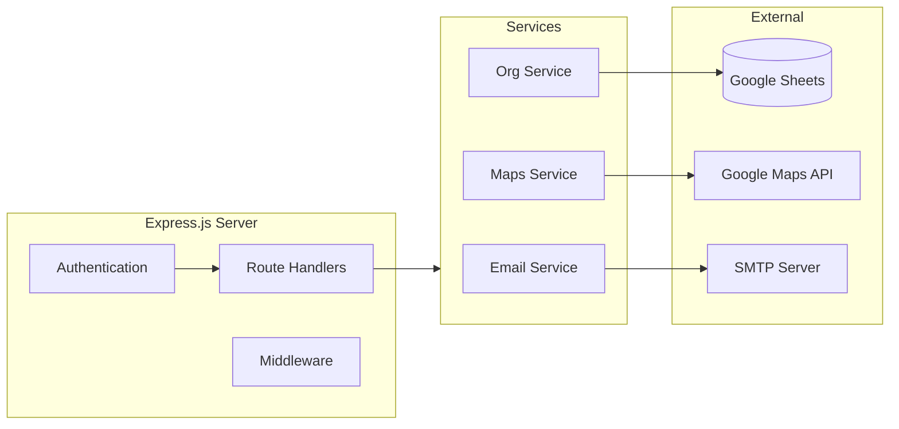

# Backend API

Express.js REST API for MedRoute Suite with Google Sheets integration.

## Architecture



## Quick Start

```bash
npm install
cp .env.example .env  # Configure environment
npm run dev           # Start dev server on :3000
```

## Environment Variables

| Variable | Description |
|----------|-------------|
| `GOOGLE_SHEET_ID` | Google Sheets document ID |
| `GOOGLE_CLIENT_EMAIL` | Service account email |
| `GOOGLE_PRIVATE_KEY` | Service account private key (base64) |
| `JWT_SECRET` | JWT signing secret |
| `EMAIL_USER` | SMTP email address |
| `EMAIL_APP_PASSWORD` | SMTP app password |

## API Routes

### Public
| Method | Endpoint | Description |
|--------|----------|-------------|
| POST | `/api/auth/login` | User login |
| POST | `/api/auth/driver/login` | Driver login |
| POST | `/api/auth/driver/register` | Driver registration |

### Protected (JWT Required)
| Method | Endpoint | Description |
|--------|----------|-------------|
| GET | `/api/org/:orgId/rides` | List rides |
| POST | `/api/org/:orgId/rides` | Create ride |
| PATCH | `/api/org/:orgId/rides/:id/status` | Update status |
| GET | `/api/org/:orgId/patients/search` | Search patients |
| GET | `/api/driver/rides` | Available rides |
| PATCH | `/api/driver/rides/:id/accept` | Accept ride |

> Full documentation: [`routes/COMPLETE_API_DOCUMENTATION.md`](./routes/COMPLETE_API_DOCUMENTATION.md)

## Deployment

Deployed on **Vercel** as serverless functions.

```bash
vercel --prod
```