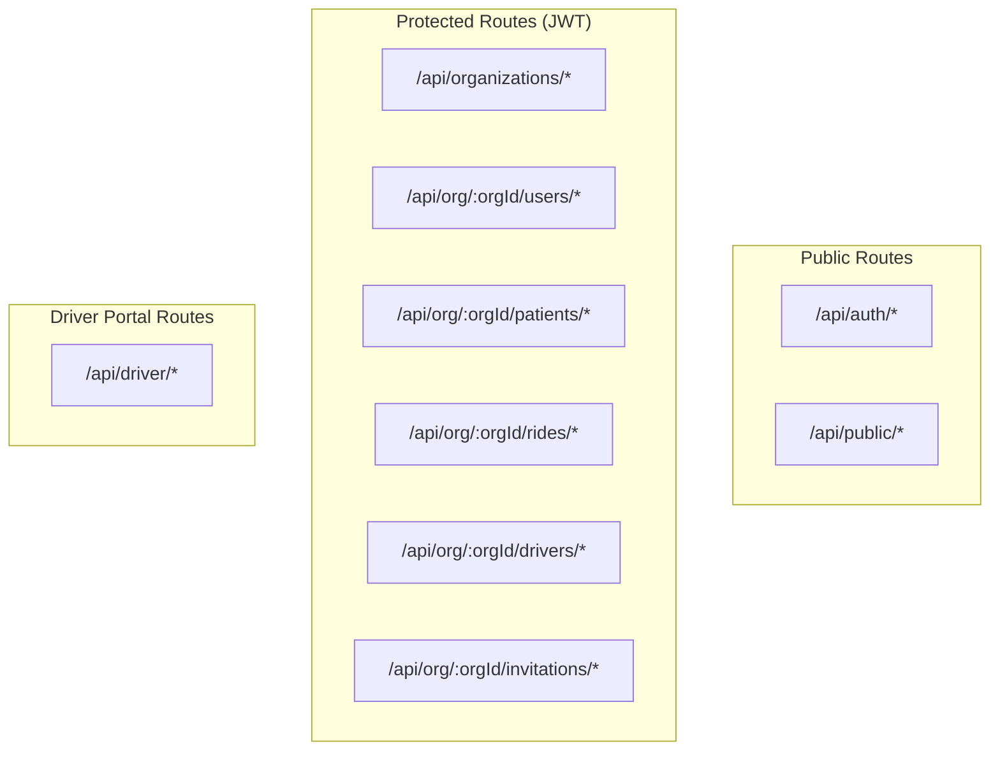

# API Documentation

Complete reference for the MedRoute Suite backend API.

## Architecture



## Route Summary

| Category | Base Path | Auth | Description |
|----------|-----------|------|-------------|
| [Auth](./AUTH_ROUTES_README.md) | `/api/auth/*` | Mixed | Login, registration, tokens |
| [Users](./USERS_ROUTES_README.md) | `/api/org/:orgId/users/*` | JWT | User management |
| [Rides](./RIDES_ROUTES_README.md) | `/api/org/:orgId/rides/*` | JWT | Ride scheduling |
| [Drivers](./DRIVER_ROUTES_README.md) | `/api/org/:orgId/drivers/*` | JWT | Driver management |
| [Patients](./PATIENTS_ROUTES_README.md) | `/api/org/:orgId/patients/*` | JWT | Patient search |
| [Appointments](./APPOINTMENTS_ROUTES_README.md) | `/api/org/:orgId/patients/:patientId/appointments` | JWT | EHR appointments |
| [Organizations](./ORGANIZATIONS_ROUTES_README.md) | `/api/organizations/*` | JWT | Org management |

## Authentication

All protected routes require JWT token:
```
Authorization: Bearer <token>
```

Tokens are obtained via `/api/auth/login` or `/api/auth/driver/login`.

## Multi-Tenant Design

- **Organizations** - Top-level entities
- **Users** - Staff belonging to organizations
- **Patients** - Individuals requiring transportation
- **Rides** - Transportation requests
- **Drivers** - Transportation providers

All data is scoped by organization ID (`orgId`).

## Common Error Codes

| Code | Description |
|------|-------------|
| 400 | Bad request / Validation error |
| 401 | Unauthorized / Invalid token |
| 403 | Forbidden / Access denied |
| 404 | Resource not found |
| 409 | Conflict / Duplicate |
| 500 | Internal server error |
