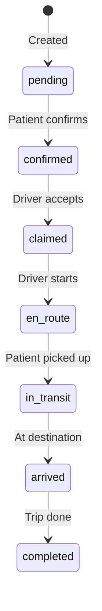

# Rides Routes

Patient transportation ride management with email notifications.

## Endpoints

| Method | Path | Description |
|--------|------|-------------|
| GET | `/api/org/:orgId/rides` | List organization rides |
| POST | `/api/org/:orgId/rides` | Create new ride |
| PATCH | `/api/org/:orgId/rides/:rideId/status` | Update ride status |
| PATCH | `/api/org/:orgId/rides/:rideId` | Update ride details |

## Ride Workflow



## Create Ride Request

```json
{
  "patientId": "PAT001",
  "patientName": "John Doe",
  "appointmentDate": "2024-01-15",
  "appointmentTime": "10:00",
  "appointmentId": "APPT001",
  "providerLocation": "123 Medical Center Dr",
  "pickupLocation": "456 Patient St",
  "roundTrip": true,
  "notes": "Wheelchair accessible"
}
```

## Ride Object

```json
{
  "id": "RIDE001",
  "orgId": "ORG001",
  "patientName": "John Doe",
  "patientId": "PAT001",
  "appointmentDate": "2024-01-15",
  "appointmentTime": "10:00",
  "pickupTime": "09:00",
  "status": "pending",
  "driverId": "DRV001",
  "driverName": "Driver Smith"
}
```

## Error Codes

| Code | Description |
|------|-------------|
| 400 | Missing required fields / Past appointment |
| 409 | Duplicate ride exists |
| 500 | Server error |
