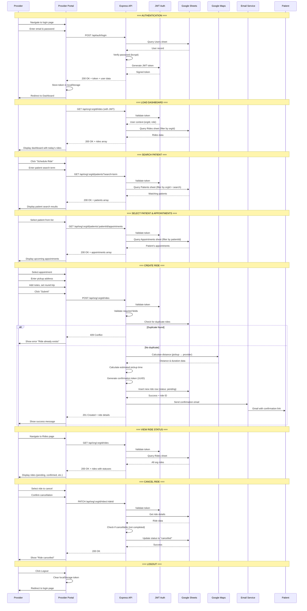

# Technical Flow Diagrams

This folder contains sequence diagrams showing the full technical flows for the MedRoute Suite.

## Provider Portal Full Flow

```mermaid
sequenceDiagram
    participant PROV as Provider
    participant PP as Provider Portal
    participant API as Express API
    participant AUTH as JWT Auth
    participant GS as Google Sheets
    participant MAPS as Google Maps
    participant EMAIL as Email Service
    participant PAT as Patient

    Note over PROV,PAT: === AUTHENTICATION ===
    PROV->>PP: Navigate to login page
    PROV->>PP: Enter email & password
    PP->>API: POST /api/auth/login
    API->>GS: Query Users sheet
    GS-->>API: User record
    API->>API: Verify password (bcrypt)
    API->>AUTH: Generate JWT token
    AUTH-->>API: Signed token
    API-->>PP: 200 OK + token + user data
    PP->>PP: Store token in localStorage
    PP->>PROV: Redirect to Dashboard

    Note over PROV,PAT: === LOAD DASHBOARD ===
    PP->>API: GET /api/org/:orgId/rides (with JWT)
    API->>AUTH: Validate token
    AUTH-->>API: User context (orgId, role)
    API->>GS: Query Rides sheet (filter by orgId)
    GS-->>API: Rides data
    API-->>PP: 200 OK + rides array
    PP->>PROV: Display dashboard with today's rides

    Note over PROV,PAT: === SEARCH PATIENT ===
    PROV->>PP: Click "Schedule Ride"
    PROV->>PP: Enter patient search term
    PP->>API: GET /api/org/:orgId/patients?search=term
    API->>AUTH: Validate token
    API->>GS: Query Patients sheet (filter by orgId + search)
    GS-->>API: Matching patients
    API-->>PP: 200 OK + patients array
    PP->>PROV: Display patient search results

    Note over PROV,PAT: === SELECT PATIENT & APPOINTMENTS ===
    PROV->>PP: Select patient from list
    PP->>API: GET /api/org/:orgId/patients/:patientId/appointments
    API->>AUTH: Validate token
    API->>GS: Query Appointments sheet (filter by patientId)
    GS-->>API: Patient's appointments
    API-->>PP: 200 OK + appointments array
    PP->>PROV: Display upcoming appointments

    Note over PROV,PAT: === CREATE RIDE ===
    PROV->>PP: Select appointment
    PROV->>PP: Enter pickup address
    PROV->>PP: Add notes, set round trip
    PROV->>PP: Click "Submit"
    PP->>API: POST /api/org/:orgId/rides
    API->>AUTH: Validate token
    API->>API: Validate required fields
    API->>GS: Check for duplicate rides
    
    alt Duplicate found
        API-->>PP: 409 Conflict
        PP->>PROV: Show error "Ride already exists"
    else No duplicate
        API->>MAPS: Calculate distance (pickup → provider)
        MAPS-->>API: Distance & duration data
        API->>API: Calculate estimated pickup time
        API->>API: Generate confirmation token (UUID)
        API->>GS: Insert new ride row (status: pending)
        GS-->>API: Success + ride ID
        API->>EMAIL: Send confirmation email
        EMAIL->>PAT: Email with confirmation link
        API-->>PP: 201 Created + ride details
        PP->>PROV: Show success message
    end

    Note over PROV,PAT: === VIEW RIDE STATUS ===
    PROV->>PP: Navigate to Rides page
    PP->>API: GET /api/org/:orgId/rides
    API->>AUTH: Validate token
    API->>GS: Query Rides sheet
    GS-->>API: All org rides
    API-->>PP: 200 OK + rides with statuses
    PP->>PROV: Display rides (pending, confirmed, etc.)

    Note over PROV,PAT: === CANCEL RIDE ===
    PROV->>PP: Select ride to cancel
    PROV->>PP: Confirm cancellation
    PP->>API: PATCH /api/org/:orgId/rides/:rideId
    API->>AUTH: Validate token
    API->>GS: Get ride details
    GS-->>API: Ride data
    API->>API: Check if cancellable (not completed)
    API->>GS: Update status to "cancelled"
    GS-->>API: Success
    API-->>PP: 200 OK
    PP->>PROV: Show "Ride cancelled"

    Note over PROV,PAT: === LOGOUT ===
    PROV->>PP: Click Logout
    PP->>PP: Clear localStorage token
    PP->>PROV: Redirect to login page
```

## Driver Portal Full Flow

```mermaid
sequenceDiagram
    participant DRV as Driver
    participant DP as Driver Portal
    participant API as Express API
    participant AUTH as JWT Auth
    participant GS as Google Sheets
    participant MAPS as Google Maps
    participant CACHE as Distance Cache

    Note over DRV,CACHE: === AUTHENTICATION ===
    DRV->>DP: Navigate to login page
    DRV->>DP: Enter email & password
    DP->>API: POST /api/auth/driver/login
    API->>GS: Query Users sheet (role: driver)
    GS-->>API: Driver user record
    API->>API: Verify password (bcrypt)
    API->>GS: Get driver profile from Drivers sheet
    GS-->>API: Driver details (vehicle, address)
    API->>AUTH: Generate JWT token
    AUTH-->>API: Signed token
    API-->>DP: 200 OK + token + driver data
    DP->>DP: Store token in localStorage
    DP->>DRV: Redirect to Available Rides

    Note over DRV,CACHE: === LOAD AVAILABLE RIDES ===
    DP->>API: GET /api/driver/rides/available
    API->>AUTH: Validate token
    AUTH-->>API: Driver context (driverId)
    API->>GS: Query Rides sheet (status: confirmed)
    GS-->>API: Confirmed rides
    API->>GS: Get driver's home address
    GS-->>API: Driver address
    
    loop For each ride
        API->>CACHE: Check cached distance
        alt Cache hit
            CACHE-->>API: Cached distance data
        else Cache miss
            API->>MAPS: Calculate distance (driver home → pickup)
            MAPS-->>API: Distance & duration
            API->>CACHE: Store in cache
        end
    end
    
    API->>API: Sort rides by distance/time
    API-->>DP: 200 OK + rides with distances
    DP->>DRV: Display available ride cards

    Note over DRV,CACHE: === ACCEPT RIDE ===
    DRV->>DP: Select ride to view details
    DP->>DRV: Show ride details modal
    DRV->>DP: Click "Accept Ride"
    DP->>API: PATCH /api/driver/rides/:rideId/accept
    API->>AUTH: Validate token
    API->>GS: Get ride details
    GS-->>API: Ride data
    
    alt Status != confirmed
        API-->>DP: 400 Ride unavailable
        DP->>DRV: Show "Ride already taken"
    else Ride available
        API->>GS: Get driver details
        GS-->>API: Driver info
        API->>MAPS: Calculate driver → pickup distance
        MAPS-->>API: Distance data
        API->>API: Calculate optimal pickup time
        API->>GS: Update ride (status: claimed, driverId, pickupTime)
        GS-->>API: Success
        API-->>DP: 200 OK + updated ride
        DP->>DRV: Show success + redirect to My Rides
    end

    Note over DRV,CACHE: === VIEW MY RIDES ===
    DP->>API: GET /api/driver/rides/my
    API->>AUTH: Validate token
    API->>GS: Query Rides sheet (driverId = current driver)
    GS-->>API: Driver's assigned rides
    API-->>DP: 200 OK + my rides
    DP->>DRV: Display upcoming rides

    Note over DRV,CACHE: === START RIDE (en_route) ===
    DRV->>DP: Click "Start Trip" on ride card
    DP->>API: PATCH /api/driver/rides/:rideId/status
    Note right of DP: Body: { status: "en_route" }
    API->>AUTH: Validate token
    API->>GS: Get ride details
    GS-->>API: Ride data
    API->>API: Validate transition (claimed → en_route)
    API->>GS: Update status to "en_route"
    GS-->>API: Success
    API-->>DP: 200 OK
    DP->>DRV: Show Active Ride page with navigation

    Note over DRV,CACHE: === PICKUP PATIENT (in_transit) ===
    DRV->>DP: Click "Patient Picked Up"
    DP->>API: PATCH /api/driver/rides/:rideId/status
    Note right of DP: Body: { status: "in_transit" }
    API->>AUTH: Validate token
    API->>API: Validate transition (en_route → in_transit)
    API->>GS: Update status to "in_transit"
    GS-->>API: Success
    API-->>DP: 200 OK
    DP->>DRV: Update UI to show "In Transit"

    Note over DRV,CACHE: === ARRIVE AT APPOINTMENT (arrived) ===
    DRV->>DP: Click "Arrived at Destination"
    DP->>API: PATCH /api/driver/rides/:rideId/status
    Note right of DP: Body: { status: "arrived" }
    API->>AUTH: Validate token
    API->>API: Validate transition (in_transit → arrived)
    API->>GS: Update status to "arrived"
    GS-->>API: Success
    API-->>DP: 200 OK
    DP->>DRV: Show "Arrived" + round trip option

    Note over DRV,CACHE: === COMPLETE RIDE ===
    DRV->>DP: Click "Complete Ride"
    DP->>API: PATCH /api/driver/rides/:rideId/status
    Note right of DP: Body: { status: "completed" }
    API->>AUTH: Validate token
    API->>API: Validate transition (arrived → completed)
    API->>GS: Update status to "completed"
    API->>GS: Update completedAt timestamp
    GS-->>API: Success
    API-->>DP: 200 OK
    DP->>DRV: Show success + redirect to Available Rides

    Note over DRV,CACHE: === VIEW RIDE HISTORY ===
    DP->>API: GET /api/driver/rides/history
    API->>AUTH: Validate token
    API->>GS: Query Rides (driverId, status: completed)
    GS-->>API: Completed rides
    API-->>DP: 200 OK + ride history
    DP->>DRV: Display completed rides list

    Note over DRV,CACHE: === UPDATE PROFILE ===
    DRV->>DP: Navigate to Profile
    DP->>API: GET /api/driver/profile
    API->>AUTH: Validate token
    API->>GS: Get driver record
    GS-->>API: Driver profile
    API-->>DP: 200 OK + profile data
    DP->>DRV: Display profile form
    
    DRV->>DP: Update vehicle info
    DRV->>DP: Click Save
    DP->>API: PUT /api/driver/profile
    API->>AUTH: Validate token
    API->>GS: Update Drivers sheet
    GS-->>API: Success
    API-->>DP: 200 OK
    DP->>DRV: Show "Profile updated"

    Note over DRV,CACHE: === CANCEL ACCEPTED RIDE ===
    DRV->>DP: Click "Cancel" on My Rides
    DP->>DRV: Confirm cancellation
    DRV->>DP: Confirm
    DP->>API: PATCH /api/driver/rides/:rideId/cancel
    API->>AUTH: Validate token
    API->>GS: Get ride details
    GS-->>API: Ride data
    API->>API: Check if cancellable (status: claimed)
    API->>GS: Update status back to "confirmed"
    API->>GS: Clear driverId & pickupTime
    GS-->>API: Success
    API-->>DP: 200 OK
    DP->>DRV: Show "Ride released"

    Note over DRV,CACHE: === LOGOUT ===
    DRV->>DP: Click Logout
    DP->>DP: Clear localStorage token
    DP->>DRV: Redirect to login page
```